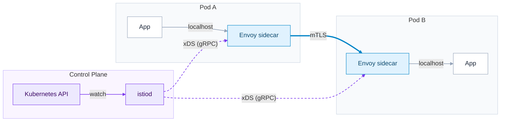
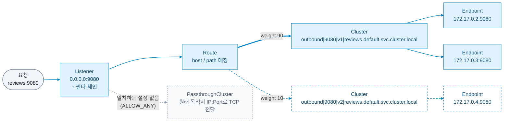
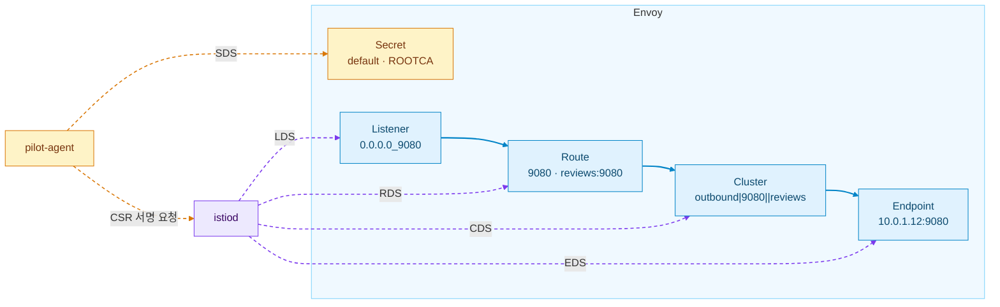
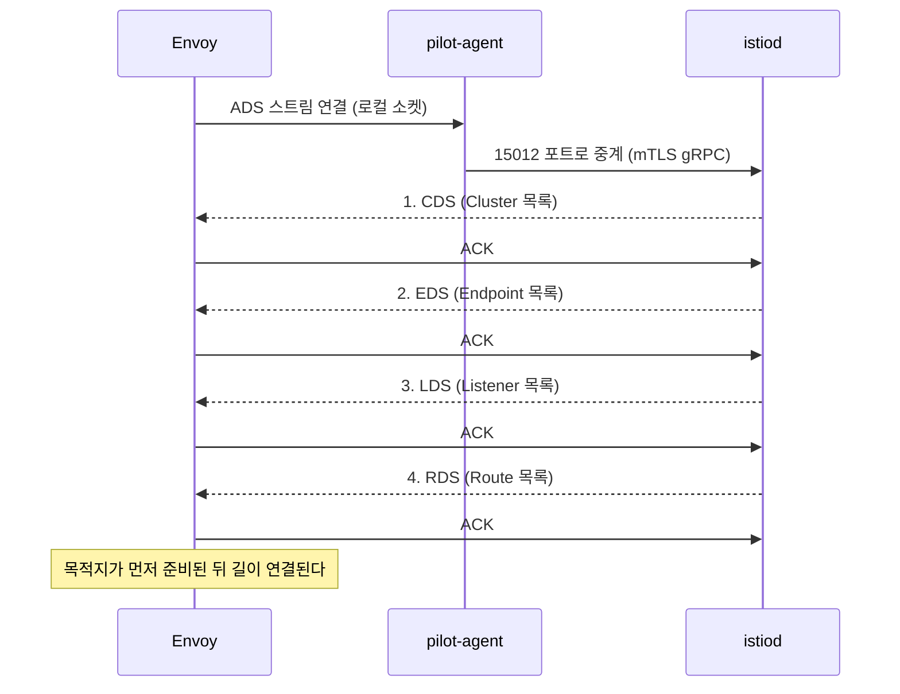
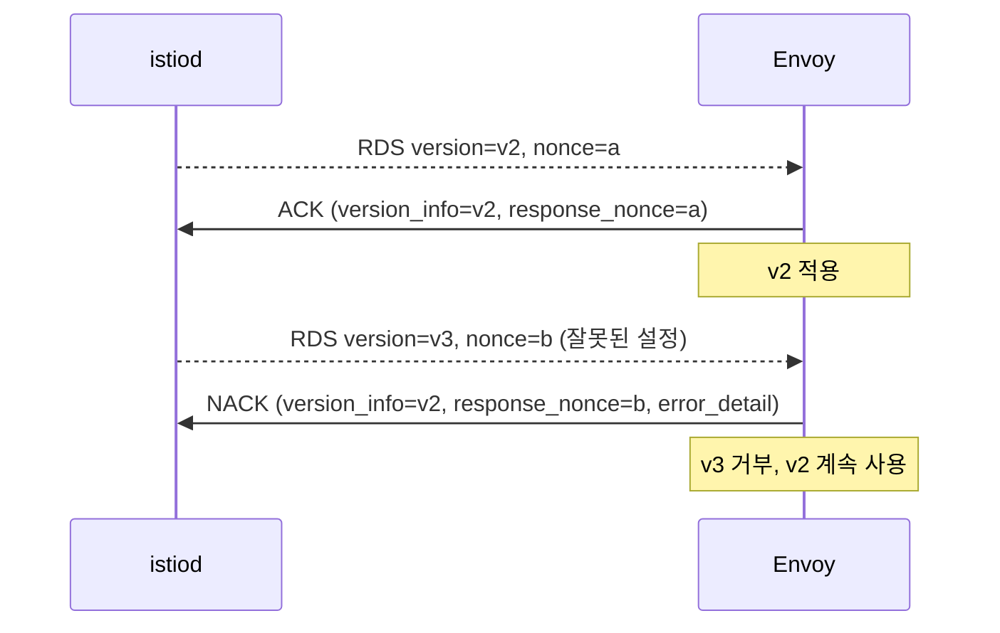
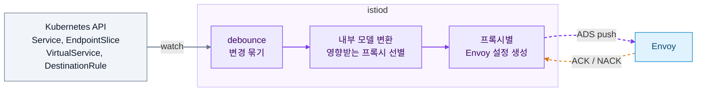

이 포스트에서는 Istio의 Envoy에 대한 기초적인 개념과 Config를 이해하고 동작 원리를 정리해본다.

## What is Envoy?

Envoy는 Lyft에서 C++로 개발한 프록시(또는 로드 밸런서)이고, 2018년에 Kubernetes, Prometheus에 이어 세 번째로 CNCF를 졸업했다. Envoy는 다른 Proxy들(HAProxy, Nginx 등)과는 다르게 Service Mesh 환경 구성에 초점을 맞추고 있다. 따라서 Envoy는 기존 Proxy들과는 다르게 Service Mesh에서 필요한 기능들을 제공하고 있다.

Envoy를 단순 Proxy로 쓰는 것도 가능하지만 Istio에서 Service Mesh를 위해 Envoy를 사이드카로 가장 많이 활용하고 있다. 기본적으로 모든 Pod에 Envoy를 사이드카 패턴으로 주입하고 Application에 흐르는 모든 트래픽이 Envoy를 거치게 된다.



보라 점선은 설정 경로(Control Plane), 굵은 파란 선은 실제 요청 경로(Data Plane)다. App은 상대 App을 직접 호출한다고 생각하지만, 실제로는 양쪽 Envoy를 한 번씩 거친다.

## Envoy에는 어떤 기능들이 있는가?

어떤 기능들이 있는지 알기 전에 왜 만들어졌는지를 보자.

Lyft는 모놀리스 시스템을 SOA로 옮기는 과정에서 네트워크 영역이 블랙박스가 되는 문제를 해결하고자 했다. 요청이 실패해도 원인이 서비스인지 네트워크인지 구분할 수 없었고, 재시도·타임아웃 같은 네트워크 동작은 언어별 라이브러리마다 달랐다.

따라서 Lyft는 Service Mesh에서 필요한 기능들을 프록시로 별도로 구현해 문제를 풀었고, 그래서 Envoy에는 다음과 같은 기능들이 있다.

1. 요청 단위 통계·트레이싱 같은 관측성 제공
2. 재시도·타임아웃·서킷 브레이커, 다양한 로드 밸런싱
3. HTTP/2와 gRPC 지원
4. 설정을 API로 받아 재시작 없이 바꾸는 동적 설정

Istio가 Envoy를 고른 이유가 이 마지막 기능이다.

### Envoy Configuration

Envoy를 Proxy로 사용할 때 4가지 개념을 기본적으로 알고 있어야 한다.

- **Listener**: 어떠한 IP·포트로 트래픽을 받고, 어떤 필터 체인으로 처리할지 등을 정의한다.
- **Route**: Listener로 들어온 요청을 어디로 라우팅할 것인지 정의한다.
- **Cluster**: 실제 요청이 처리되는 IP 또는 여타 엔드포인트의 묶음을 의미한다.
- **Endpoint**: `172.17.0.2`, `172.17.0.3`과 같이 실제로 접근 가능한 엔드포인트를 의미한다. 엔드포인트가 모여서 하나의 Cluster가 된다.

요청 하나가 네 개념을 통과하는 순서는 다음과 같다.



Istio 환경에서 Cluster 이름은 `방향|포트|subset|호스트` 형식이다. 위 그림의 v1 Cluster는 DestinationRule subset `v1`으로 가는 outbound 묶음이고, Endpoint는 그 아래 실제 Pod IP와 컨테이너 포트다. Envoy가 목적지에 대한 Cluster를 받지 못했다면 `PassthroughCluster`로 빠지며, 이때는 재시도·타임아웃 같은 L7 기능이 적용되지 않는다.

## xDS를 이용한 API Driven Configuration

Envoy의 핵심이자 Istio가 선택한 이유라고 볼 수 있는 xDS와 API Driven Configuration에 대해 알아보자. 먼저 API Driven Configuration은 복잡한 네트워크 설정들을 직접 YAML에 작성할 필요 없이 API를 통해 동적으로 Runtime에 설정할 수 있다는 것이다.

Envoy는 앞서 언급한 Listener, Route, Cluster, Endpoint 등을 동적으로 로드할 수 있는 Discovery Service API를 사용하고 있는데, 이러한 API를 각각 LDS, RDS, CDS, EDS라고 부르며, 이 Discovery Service API의 집합을 **xDS**라고 부른다.

### xDS 종류

Istio 환경의 Envoy는 설정 파일을 다시 읽지 않고, 대신 Runtime에 Istiod(Control Plane)로부터 API로 설정을 받는다. 이 API 묶음이 xDS("x Discovery Service")이다.

- **LDS(Listener)**: 어떤 IP·포트로 트래픽을 받고, 어떤 필터 체인으로 처리하는지 정한다. HTTP connection manager, RBAC, JWT, 텔레메트리 필터가 여기에 들어간다.
- **RDS(Route)**: HTTP 요청을 어느 Cluster로 보낼지 정하며 VirtualService가 주로 여기에 들어간다. 따라서 가중치, 재시도, 타임아웃 설정이 여기에 있다.
- **CDS(Cluster)**: 업스트림 서비스 그룹 하나와 그 연결 방식을 정의한다. 목적지 서비스 단위의 설정으로 LB 알고리즘, 커넥션 풀, outlier detection, 업스트림 TLS를 담고 있다. DestinationRule이 주로 여기에 들어간다.
- **EDS(Endpoint)**: Cluster에 속한 실제 엔드포인트 IP 목록이다. 파드가 뜨고 죽을 때마다 바뀌므로 가장 자주 바뀐다.
- **SDS(Secret)**: mTLS 인증서와 키, 게이트웨이 TLS 인증서, CA 루트가 여기에 들어간다. 단, 사이드카의 워크로드 인증서는 istiod가 아니라 파드 안의 `pilot-agent`가 istiod CA에 서명을 받아 SDS로 Envoy에 직접 건넨다.

앞의 Listener → Route → Cluster → Endpoint 체인에 xDS를 겹쳐 보면 다음과 같다.



보라 점선은 istiod가 보내는 xDS, 주황 점선은 인증서 경로, 파란 실선은 요청이 실제로 지나가는 순서다. 노드 아래의 이름은 `reviews` 서비스(9080 포트)를 호출하는 파드에서 `istioctl proxy-config`로 보이는 실제 형태를 예로 든 것이다(Cluster 이름은 원래 `outbound|9080||reviews.default.svc.cluster.local`인데 줄여 적었다). 뒤의 [직접 확인해보기](#직접-확인해보기)에서 같은 이름을 다시 만난다.

### 의존성 정리

- Envoy xDS 프로토콜 문서가 권장하는 순서는 CDS → EDS → LDS → RDS이다.
- 라우트가 아직 존재하지 않는 클러스터를 가리키면 트래픽이 DROP되기 때문에 목적지를 먼저 만들고 그 다음 길을 연결한다.
- 따라서 실 서비스 적용 시, Subset을 새로 쓰려면 DestinationRule을 먼저, VirtualService를 나중에 적용한다. 반대로 할 경우 존재하지 않는 subset 클러스터로 라우팅되어 503이 발생할 수 있다.

## xDS는 실제로 어떻게 설정을 전달하는가

앞에서는 xDS가 어떤 설정을 전달하는지 봤다. 이번에는 그 설정이 실제로 어떻게 Envoy까지 전달되는지를 부트스트랩, ADS, 전달 방식(SotW와 Delta), ACK/NACK 순서로 따라가 본다.

### 1. 부트스트랩: 처음 한 번은 파일로 시작한다

Envoy가 모든 설정을 API로 받는다고 해도, "어디서 받을지"는 알아야 한다. 그래서 Envoy는 기동 시 부트스트랩 설정 파일 하나를 읽는다.

- Istio 사이드카에서는 `pilot-agent`가 파드 정보(이름, 네임스페이스, 라벨 등)를 넣어 부트스트랩 파일(`/etc/istio/proxy/envoy-rev.json`)을 생성하고 Envoy를 띄운다.
- 이 파일의 정적 부분에는 admin 포트와 xDS 서버로 가는 클러스터(`xds-grpc`)만 들어 있다.
- 나머지 Listener, Route, Cluster, Endpoint, Secret은 전부 `dynamic_resources`로 선언되어 xDS로 받아온다.

즉 부트스트랩은 "Control Plane의 주소"만 알려주고, 실제 트래픽 설정은 전부 런타임에 받는다.

### 2. ADS: 하나의 스트림으로 순서를 보장한다

xDS의 각 API(LDS, RDS, CDS, EDS, SDS)는 원래 서로 다른 서버, 서로 다른 스트림으로 받을 수 있다. 그런데 스트림이 나뉘어 있으면 앞의 의존성 정리에서 본 CDS → EDS → LDS → RDS 순서를 보장할 수 없다. RDS가 CDS보다 먼저 도착하면 존재하지 않는 클러스터를 가리키게 되고 트래픽이 DROP된다.

이 문제를 풀기 위해 Envoy는 <strong>ADS(Aggregated Discovery Service)</strong>를 제공한다. 모든 리소스 타입을 하나의 gRPC 스트림으로 주고받기 때문에, Control Plane이 보내는 순서를 직접 제어할 수 있다.

- Istio는 ADS를 사용한다.
- 연결 경로는 Envoy → `pilot-agent`(로컬 xDS 프록시) → istiod `15012` 포트(mTLS gRPC)이다.
- istiod는 하나의 스트림 안에서 CDS, EDS, LDS, RDS 순서로 응답을 보내 순서 문제를 피한다.



단, ADS가 보장하는 것은 "하나의 Envoy 안에서"의 순서다. 메시 전체의 수백 개 Envoy가 동시에 같은 설정을 받는다는 보장은 없다(Eventual Consistency). 그래서 DestinationRule을 먼저 적용하고, 전파된 것을 확인한 뒤 VirtualService를 적용하는 운영 순서가 여전히 필요하다.

### 3. 전달 방식: SotW와 Delta

xDS에는 설정을 보내는 방식이 두 가지 있다.

| 방식                      | 보내는 내용                | 특징                                                                                                         |
| ------------------------- | -------------------------- | ------------------------------------------------------------------------------------------------------------ |
| SotW (State of the World) | 해당 타입의 리소스 전체    | 구현이 단순하다. 대신 리소스가 많으면 작은 변경에도 전체를 다시 보내므로 istiod CPU와 네트워크 부담이 커진다. |
| Delta (Incremental)       | 추가·변경·삭제된 리소스만 | 대규모 메시에서 푸시 비용이 작다. 구현이 복잡하다.                                                          |

Istio는 두 방식을 모두 지원한다. 어느 방식이든 파드 하나가 늘어나는 것처럼 Endpoint만 바뀌는 경우에는 istiod가 EDS만 다시 보내는 부분 푸시(incremental push)를 하고, VirtualService처럼 라우팅이 바뀌면 관련 Listener·Route를 다시 계산해 보낸다.

### 4. ACK / NACK: 잘못된 설정은 거부된다

xDS는 단방향 푸시가 아니라 요청·응답 프로토콜이다. Envoy는 설정을 받을 때마다 결과를 다시 알려준다.

- **ACK**
  - Envoy가 설정을 정상 적용하면, 다음 요청의 `version_info`에 방금 받은 버전을, `response_nonce`에 방금 받은 응답의 nonce를 담아 보낸다.
- **NACK**
  - 설정이 잘못되어 적용할 수 없으면, `version_info`에는 마지막으로 성공한 이전 버전을 그대로 두고 `error_detail`에 거부 사유를 담아 보낸다.
  - 이때 Envoy는 **이전 설정을 계속 사용한다.** 잘못된 설정 하나 때문에 프록시 전체가 죽지 않도록 하는 안전장치다.

운영 관점에서 NACK는 조용한 실패다. 트래픽은 이전 설정으로 계속 흐르기 때문에 에러가 나지 않고, "설정을 바꿨는데 반영이 안 된다"는 증상으로만 드러난다. istiod의 `pilot_total_xds_rejects` 메트릭으로 NACK 발생을 확인할 수 있다.



NACK 응답의 `version_info`가 여전히 v2라는 점이 핵심이다. istiod는 "이 Envoy는 아직 v2에 머물러 있다"는 것을 이 값으로 안다.

### 5. Istiod 입장에서 본 전체 흐름

지금까지 내용을 Istiod 기준으로 한 줄로 이으면 다음과 같다.

1. Kubernetes API를 watch한다 (Service, EndpointSlice, VirtualService, DestinationRule, PeerAuthentication 등).
2. 변경을 감지하면 짧은 시간 동안 모아서(debounce) 한 번에 처리한다. 변경이 몰릴 때 푸시 폭주를 막기 위함이다.
3. 변경 내용을 내부 모델로 변환하고, 영향을 받는 프록시를 골라낸다.
4. 프록시마다 Envoy 설정(Listener, Route, Cluster, Endpoint)을 생성한다. 워크로드 인증서는 앞서 본 것처럼 `pilot-agent`가 SDS로 따로 건넨다.
5. ADS 스트림으로 순서에 맞춰 푸시하고, ACK/NACK를 받는다.



### 직접 확인해보기

xDS로 받은 설정은 `istioctl`로 그대로 들여다볼 수 있다. 명령어가 xDS 타입과 1:1로 대응하므로, 개념을 확인하기에 가장 좋은 방법이다.

```bash
# 각 프록시가 istiod와 동기화되었는지 (SYNCED / NOT SENT / STALE)
istioctl proxy-status

# xDS 타입별로 실제 받은 설정 확인
istioctl proxy-config listeners <pod> -n <namespace>   # LDS
istioctl proxy-config routes <pod> -n <namespace>      # RDS
istioctl proxy-config clusters <pod> -n <namespace>    # CDS
istioctl proxy-config endpoints <pod> -n <namespace>   # EDS
istioctl proxy-config secret <pod> -n <namespace>      # SDS
```

`proxy-status`에서 `STALE`이 보이면 istiod가 보낸 설정에 Envoy가 응답하지 않았거나 NACK한 경우이므로, 앞의 ACK/NACK 흐름을 떠올리면 된다.

## 정리

- Envoy는 Service Mesh에 필요한 관측성, 트래픽 제어, 동적 설정을 제공하는 프록시이고, Istio가 Envoy를 고른 결정적 이유는 동적 설정(xDS)이다.
- Envoy 설정은 Listener → Route → Cluster → Endpoint로 이어지고, 각각을 LDS, RDS, CDS, EDS로 받으며 인증서는 SDS로 받는다.
- Istio 리소스는 대략 다음과 같이 xDS에 대응한다.

| Istio / K8s 리소스                 | 주로 반영되는 xDS |
| ---------------------------------- | ----------------- |
| VirtualService                     | RDS               |
| DestinationRule                    | CDS               |
| Service, EndpointSlice             | CDS, EDS          |
| Gateway, PeerAuthentication        | LDS               |
| 워크로드 인증서, Gateway TLS 인증서 | SDS               |

- 순서가 중요하다: 목적지(CDS/EDS)를 먼저 만들고 길(LDS/RDS)을 나중에 연결한다. ADS는 한 Envoy 안의 순서만 보장하고, 메시 전체는 Eventual Consistency다.
- 잘못된 설정은 NACK되고 이전 설정이 유지되므로, "반영이 안 된다"면 `istioctl proxy-status`와 `pilot_total_xds_rejects`부터 확인한다.

이번 글은 Envoy와 xDS가 어떤 모양으로 맞물려 있는지 전체를 훑어보는 데 집중했다. 다음 글에서는 xDS 하나만 붙잡고 깊게 다이브해서, 실제 프로토콜 메시지와 istiod의 푸시 동작을 톺아볼 생각이다.
