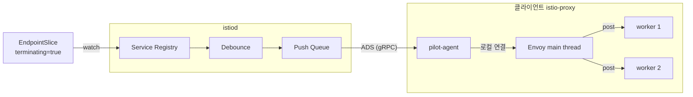
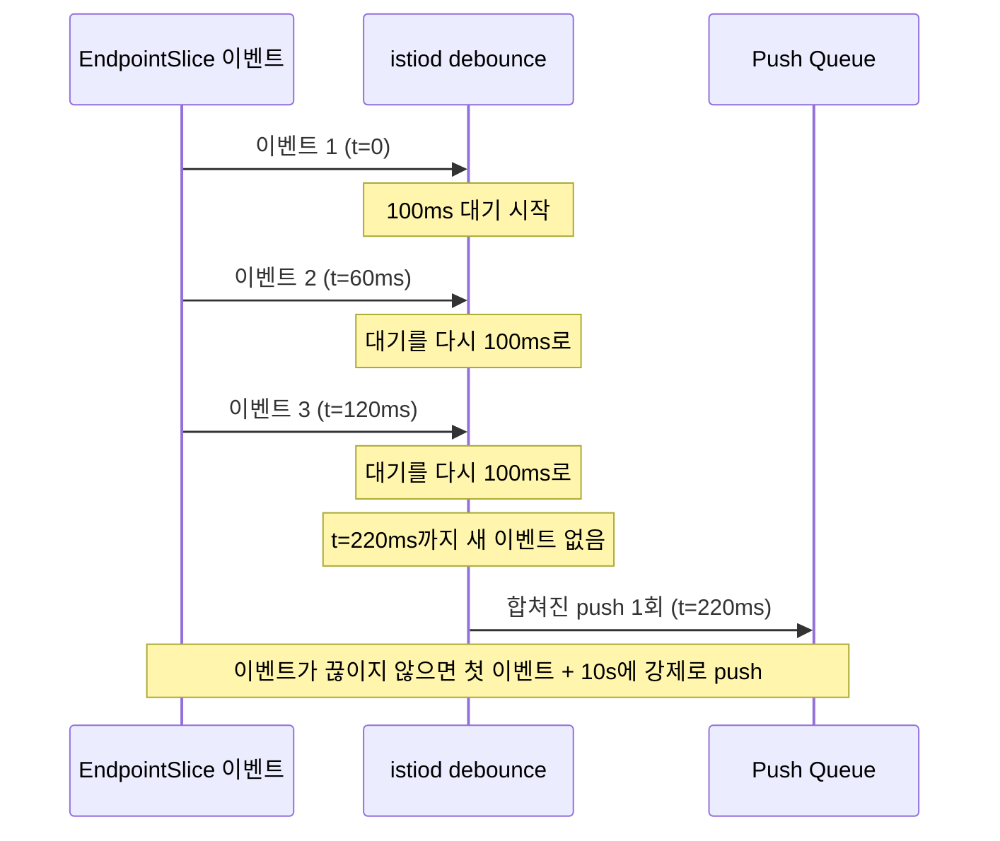
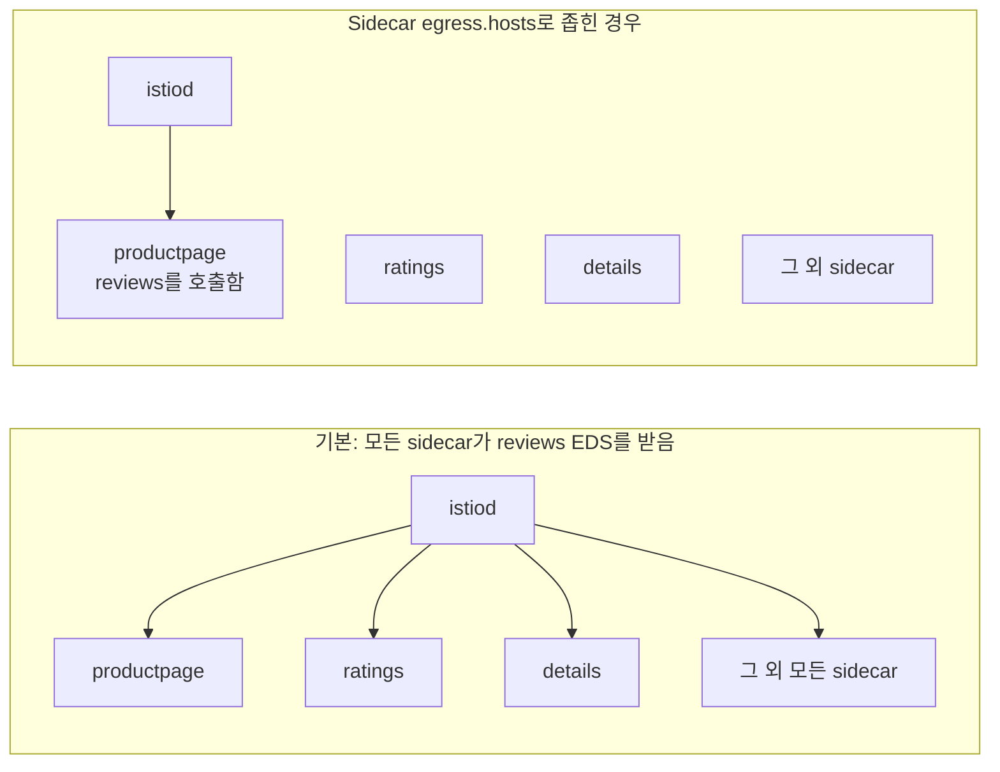
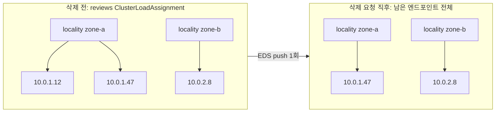
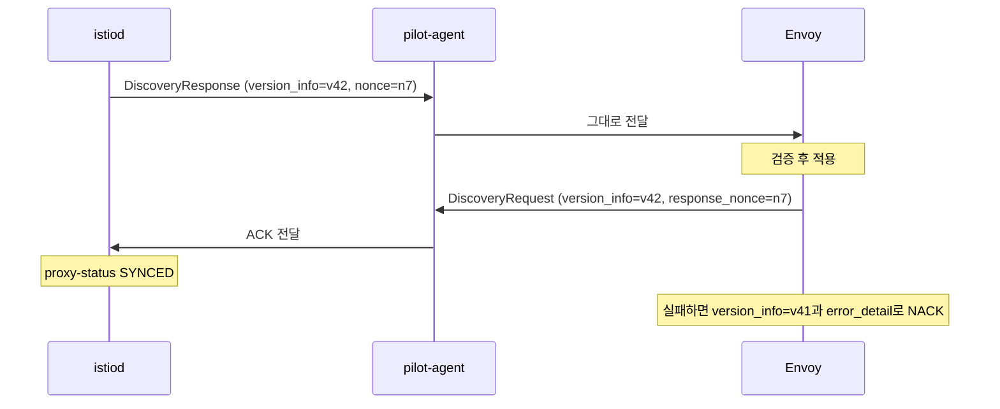
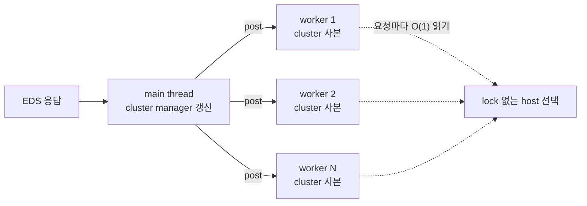
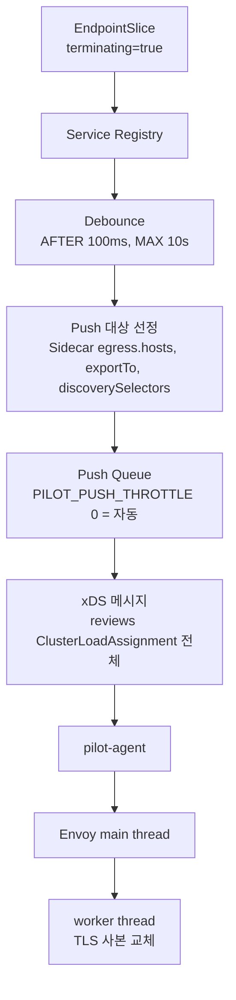

> 이 글은 Istio 1.31, Kubernetes 1.33 이상을 기준으로 한다.

## 이 글은

[1편](/2026-09-26-istio-envoy-xds/)에서는 Envoy와 xDS가 어떤 모양으로 맞물려 있는지 전체를 훑어봤다. 그 글 끝에서 xDS 하나만 붙잡고 실제 프로토콜 메시지와 istiod의 푸시 동작을 톺아보겠다고 했는데, 이 글이 그 글이다.

"istiod가 변경을 감지해서 Envoy에 내려준다" 정도로 알고 있었는데, 파드 하나가 삭제되는 상황을 놓고 실제로 따라가 보니 질문이 꼬리를 물었다.

- istiod는 무엇을 보고 파드가 사라졌다는 사실을 아는가
- 변경이 생길 때마다 바로 보내는가
- 메시의 모든 Envoy가 이 변경을 받는가
- 와이어 위에는 실제로 어떤 메시지가 오가는가
- 요청을 처리하고 있던 Envoy는 언제, 어떻게 새 엔드포인트 목록을 쓰기 시작하는가

이 글은 파드 하나의 삭제를 따라가며 이 질문들에 차례로 답한다. 범위는 sidecar 모드, 단일 클러스터, Kubernetes 서비스 레지스트리다. 파드가 삭제될 때 Kubernetes 쪽(kubelet, graceful termination)에서 일어나는 일은 다루지 않고, istiod가 받는 입력부터 시작한다. 따라갈 경로를 한 장으로 그리면 다음과 같다.



## Background: 1편 요약

- Envoy는 Listener → Route → Cluster → Endpoint 순서로 요청을 처리한다.
- 각 단계의 설정은 LDS, RDS, CDS, EDS로 받고, 인증서는 SDS로 받는다.
- Istio sidecar는 ADS, 즉 gRPC 스트림 하나로 모든 타입을 받는다. 그래서 CDS → EDS → LDS → RDS 순서를 지켜 적용할 수 있다.
- Envoy는 응답을 받으면 `version_info`와 nonce를 담아 ACK나 NACK으로 답한다.

이번 글에서 따라갈 변화는 이 중 Endpoint 하나가 빠지는 일이다.

## EndpointSlice

파드가 삭제될 때 istiod가 보는 입력은 EndpointSlice다. 그런데 파드에 삭제 요청이 들어와도 EndpointSlice에서 엔드포인트가 바로 지워지지는 않는다. 엔드포인트는 남아 있고 상태만 바뀐다. 이 상태를 표현하는 것이 conditions다.

### Conditions

Kubernetes 문서는 엔드포인트의 상태를 세 condition으로 나눈다.

- `serving`: 파드의 Ready condition을 그대로 따른다.
- `terminating`: 파드에 deletion timestamp가 붙으면 true가 된다.
- `ready`: `serving`이면서 `terminating`이 아닐 때 true다. 예외로 `publishNotReadyAddresses`가 켜진 서비스는 항상 true다.

`serving`과 `terminating`은 Kubernetes 1.20에 alpha로 들어와 1.26에 GA가 됐다.

처음에는 `ready` 하나면 충분해 보였다. 왜 굳이 셋으로 나눴을까. 문서의 설명을 보면 이유가 드러난다. 프록시는 보통 `terminating` 엔드포인트를 무시하지만, 서비스의 모든 엔드포인트가 종료 중이라면 `serving`이면서 `terminating`인 엔드포인트로라도 트래픽을 보낼 수 있다. 즉 "새 트래픽은 보내지 마라"와 "아직 요청을 처리할 수는 있다"를 따로 표현하려고 나눈 것이다. 롤링 업데이트 중 모든 파드가 동시에 종료 중인 순간에도 트래픽이 갈 곳을 남겨 두려는 장치다.

### 파드 삭제 전후 비교

`reviews` 서비스의 파드 하나를 삭제한다고 하자. 삭제 전 EndpointSlice에서 그 파드의 엔드포인트는 다음과 같다.

```yaml
endpoints:
- addresses: ["10.0.1.12"]
  conditions:
    ready: true
    serving: true
    terminating: false
  targetRef:
    kind: Pod
    name: reviews-v1-7d8f9c-abcde
```

삭제 요청이 들어온 직후에는 이렇게 바뀐다.

```yaml
endpoints:
- addresses: ["10.0.1.12"]
  conditions:
    ready: false        # terminating이므로 false
    serving: true       # 종료 중에도 Ready condition이 유지되면 true
    terminating: true
  targetRef:
    kind: Pod
    name: reviews-v1-7d8f9c-abcde
```

엔드포인트가 완전히 사라지는 것은 파드 객체가 실제로 삭제된 뒤다. 그러니 istiod가 받는 변화는 두 번이다. 한 번은 "종료 중"으로 바뀌는 UPDATE이고, 다른 한 번은 엔드포인트가 목록에서 빠지는 UPDATE다. 트래픽 관점에서 중요한 것은 첫 번째다.


다른 터미널에서 파드를 지우면서 아래 명령을 걸어 두면 conditions가 바뀌는 순간을 볼 수 있다.

```bash
kubectl get endpointslice -n default -l kubernetes.io/service-name=reviews -o yaml -w
```

엔드포인트는 사라지지 않고 상태만 바뀌었다. 그렇다면 istiod는 이 변화를 어떻게 받아 들고 있을까.

## istiod

### Service Registry

istiod는 Kubernetes API를 watch하면서 Service와 EndpointSlice를 자신의 서비스 모델로 바꿔 들고 있다. 1편에서 본 VirtualService, DestinationRule 같은 Istio 설정과는 별개의 입력이다.

흥미로운 점은 istiod가 Kubernetes Service를 Istio의 ServiceEntry와 같은 종류로 다룬다는 것이다. Istio 문서의 설정 비용 분석 절을 보면, Kubernetes Service와 Endpoints의 변경은 push 원인을 집계할 때 ServiceEntry로 표시된다. Kubernetes Service든 ServiceEntry든 istiod 안에서는 "서비스와 그 엔드포인트 집합"이라는 같은 모델로 합쳐진다는 뜻으로 읽힌다.

istiod가 EndpointSlice 외에 Pod 객체도 watch해서 라벨, locality, service account 같은 워크로드 정보를 채우는지는 공식 문서에서 찾지 못했다.

이제 istiod의 엔드포인트 모델에 변화가 하나 들어왔다. 바로 보내면 될까?

### Debounce

바로 보내면 문제가 생긴다. 롤링 업데이트를 생각해 보자. replica가 20개인 Deployment를 교체하면 짧은 시간 동안 EndpointSlice 이벤트가 수십 번 들어온다. 이벤트마다 push하면 istiod는 같은 서비스의 엔드포인트 목록을 수십 번 다시 만들어 관련된 모든 프록시에 보낸다. 대부분은 곧바로 다음 push에 덮어쓰일 중간 상태다.

그래서 istiod는 이벤트를 바로 보내지 않고 잠시 모은다. 이것이 debounce다. 세 환경변수가 동작을 정한다.

| 환경변수 | 기본값 | 의미 |
|---|---|---|
| `PILOT_DEBOUNCE_AFTER` | 100ms | 마지막 이벤트 뒤 이만큼 조용하면 push한다. 그 사이 새 이벤트가 오면 다시 기다린다. |
| `PILOT_DEBOUNCE_MAX` | 10s | 이벤트가 끊이지 않아도 첫 이벤트로부터 이만큼 지나면 push한다. |
| `PILOT_ENABLE_EDS_DEBOUNCE` | true | EDS push도 debounce 대상에 넣는다. |

`PILOT_ENABLE_EDS_DEBOUNCE`의 문서 설명이 이 장치의 트레이드오프를 그대로 말해 준다. EDS push가 늦어질 수 있지만 push 횟수는 줄어든다. 파드 하나가 삭제되면 그 변화는 최소 100ms, 이벤트가 계속 몰리면 최대 10초까지 istiod 안에 머문다.



debounce 동안 모인 이벤트는 push 요청 하나로 합쳐진다. 이때 합쳐진 요청이 full push인지 아닌지도 함께 정해진다. istiod 로그에서 이 순간을 볼 수 있다. Istio 문서는 `Push debounce stable ... full=true` 형태의 로그를 예로 들면서, `full=false`는 엔드포인트 변경처럼 최적화된 업데이트를 뜻한다고 설명한다. 모인 이벤트 중 하나라도 full push가 필요하면 합쳐진 요청 전체가 full push가 되는지는 문서에 명시돼 있지 않다.

첫 이벤트가 debounce에 들어온 시점부터 합쳐진 push가 큐에 들어가기까지 걸린 시간은 `pilot_debounce_time` 메트릭으로 볼 수 있다.

### Incremental Push와 Full Push

방금 로그에 나온 `full=true`와 `full=false`가 이 절의 주제다.

full push는 메시 전체 설정의 스냅샷(PushContext)을 다시 만들고, 영향을 받는 프록시의 설정을 타입 전체에 걸쳐 다시 생성하는 push다. 1편에서 VirtualService가 바뀌면 관련 Listener와 Route를 다시 계산한다고 했는데, 그런 변경이 full push를 일으킨다. PushContext를 다시 만드는 비용은 `pilot_pushcontext_init_seconds`로 따로 잰다.

엔드포인트만 바뀐 경우는 다르다. Istio 문서는 Endpoints 변경이 "heavily optimized" 되어 있다고 설명한다. 1편에서 쓴 대로, 엔드포인트만 바뀌면 istiod는 바뀐 서비스의 EDS만 다시 보낸다. 다만 "EDS만 보낸다"는 표현 자체는 문서에 없고, 어떤 변경이 full push를 일으키는지 정리한 공식 목록도 없다. 가장 가까운 것은 push 원인별로 집계되는 `pilot_push_triggers` 메트릭이다.

그러면 1편의 문장, "엔드포인트만 바뀌면 EDS만 보낸다"는 언제나 성립할까. 예외 후보가 몇 가지 있다.

- **headless 서비스**
  - Istio 1.21까지는 `PILOT_ENABLE_HEADLESS_SERVICE_POD_LISTENERS`(기본 true)가 headless 서비스의 파드마다 outbound listener를 따로 만들었다. listener가 파드 단위라면 파드 하나의 변화가 LDS까지 건드리므로 EDS만으로 끝날 수 없다.
  - 이 플래그는 1.22에서 제거됐고, 그 뒤 동작은 문서에 설명이 없다. 설정 범위 FAQ는 HTTP가 아닌 headless 서비스의 설정 크기가 인스턴스 수에 비례한다고만 적고 있다. 지금도 파드 변화가 LDS push를 일으키는지는 `pilot_xds_pushes`를 타입별로 보며 확인해야 한다.
- **서비스에 첫 엔드포인트가 생기거나 마지막 엔드포인트가 사라질 때**: 문서에서 동작을 찾지 못했다.
- **파드 라벨이 바뀌어 DestinationRule subset 멤버십이 달라질 때**: 문서에서 동작을 찾지 못했다.

파드 하나를 지운 뒤 아래 두 메트릭을 push 타입과 원인별로 보면, 그 변화가 EDS만 일으켰는지 다른 타입까지 건드렸는지 구분할 수 있다.

```text
sum by (type) (increase(pilot_xds_pushes[5m]))
sum by (type) (increase(pilot_push_triggers[5m]))
```

### Terminating Endpoint

다시 우리가 따라가는 파드로 돌아오자. EndpointSlice에서 이 파드의 엔드포인트는 `ready=false`, `terminating=true`가 됐다. istiod는 이 엔드포인트를 EDS에 넣어야 할까, 빼야 할까.

단순하게 생각하면 빼면 된다. 그런데 Istio에는 준비되지 않은(unhealthy) 엔드포인트를 일부러 보내는 옵션이 따로 있고, 그 기본 동작이 버전마다 달라졌다.

- **`PILOT_SEND_UNHEALTHY_ENDPOINTS` (기본 false)**
  - 켜면 unhealthy 엔드포인트도 health status를 붙여 EDS에 넣는다. Envoy는 이 엔드포인트로 로드밸런싱하지 않는다.
  - 문서는 이 플래그를 켜면 Envoy의 panic threshold가 꺼진다고 적고 있다. 정상 엔드포인트 비율이 임계값 아래로 떨어져도 unhealthy 엔드포인트로 트래픽을 보내지 않게 하기 위해서다.
- **Istio 1.25**
  - `PILOT_SEND_UNHEALTHY_ENDPOINTS`가 켜져 있어도 terminating 엔드포인트는 포함하지 않도록 바뀌었다. 스케일다운이나 롤아웃 중에 서비스 전체가 unhealthy처럼 보이는 문제를 막기 위해서다.
- **Istio 1.31**
  - `PILOT_AUTO_SEND_UNHEALTHY_ENDPOINTS`(기본 true)가 추가됐다. DestinationRule의 OutlierDetection에 `minHealthPercent`가 0보다 크게 설정되지 않았다면 unhealthy 엔드포인트를 보낸다.

왜 unhealthy 엔드포인트를 보내는 일과 panic threshold가 엮여 있을까. Envoy는 cluster의 정상 host 비율이 panic threshold 아래로 떨어지면, 건강 상태를 무시하고 모든 host로 트래픽을 나눈다. unhealthy 엔드포인트를 EDS에 넣는 순간 Envoy가 보는 정상 비율이 떨어지고, 그러면 오히려 unhealthy host로 트래픽이 갈 수 있다. 그래서 unhealthy를 보내려면 panic threshold를 끄거나, 1.31처럼 `minHealthPercent` 설정과 연결해야 한다. panic threshold의 정의는 Sidecar 절에서 다시 본다.

정리하면, 1.30까지 기본 설정에서는 `ready=false`인 terminating 엔드포인트가 unhealthy로 분류되어 EDS에서 빠진다고 볼 수 있다. 1.31의 자동 모드가 terminating 엔드포인트까지 보내는지는 문서에 없다. 이 부분은 직접 확인해 볼 수밖에 없다. 파드를 지운 직후 클라이언트 sidecar에서 엔드포인트 목록과 상태를 보고, 삭제된 파드의 IP가 목록에서 빠지는지 `UNHEALTHY` 같은 상태로 남는지 확인하면 된다.

```bash
istioctl proxy-config endpoints <client-pod> -n default \
  --cluster "outbound|9080||reviews.default.svc.cluster.local"
```

참고로 EndpointSlice가 아닌 라벨로 종료를 표시하는 경로도 있다. `PILOT_DRAINING_LABEL`(기본 `istio.io/draining`)이 붙은 엔드포인트는 DRAINING 상태로 전송된다.

### Push 대상 선정

엔드포인트 목록이 정해졌다. 이제 이 변경을 누구에게 보낼지 정해야 한다.

Istio의 기본 동작은 생각보다 넓다. Sidecar 리소스 문서에 따르면, 기본적으로 메시의 모든 sidecar는 메시의 모든 워크로드 인스턴스에 도달할 수 있도록 설정된다. 모든 sidecar가 `reviews` cluster를 갖고 있으니, `reviews` 파드 하나의 변화는 기본적으로 메시의 모든 sidecar에 전해진다.

메시가 커지면 이 구조가 비용이 된다. push 한 번의 비용은 대략 "보낼 프록시 수 × 보낼 설정의 크기"이고, 기본 설정에서는 둘 다 메시 크기에 비례한다. Istio는 이 범위를 좁히는 장치를 세 가지 둔다.

- **Sidecar 리소스의 `egress.hosts`**: 이 sidecar가 실제로 호출하는 서비스만 보게 한다. 범위 밖 서비스의 변경은 이 sidecar로 가지 않는다.
- **`exportTo`**: 서비스 소유자가 자기 서비스를 어느 네임스페이스에 보일지 정한다. VirtualService, DestinationRule, ServiceEntry의 `spec.exportTo`나 Service의 `networking.istio.io/exportTo` 어노테이션으로 지정한다.
- **MeshConfig의 `discoverySelectors`**: istiod가 설정을 계산할 때 고려할 네임스페이스를 정한다. 맞지 않는 네임스페이스는 아예 무시한다.



Sidecar 리소스는 Gateway에는 적용되지 않는다는 점도 기억해 둘 만하다.

### Push Queue

보낼 프록시가 정해지면 각 프록시에 대한 push가 큐에 들어간다. 프록시가 수백 개라면 동시에 몇 개까지 보낼지가 문제가 된다.

이를 정하는 것이 `PILOT_PUSH_THROTTLE`다. 이름 때문에 초당 처리율 제한으로 오해하기 쉬운데, 문서는 동시에 진행할 수 있는 push 수의 상한이라고 설명한다. 기본값은 1.20까지 100이었고, 1.21부터는 0이다. 0이면 istiod가 실행되는 머신의 크기(CPU)에 맞춰 상한을 자동으로 정한다. 초당 들어오는 요청을 제한하는 것은 별개 변수인 `PILOT_MAX_REQUESTS_PER_SECOND`다.

큐에 관한 두 메트릭이 있다.

- `pilot_proxy_queue_time`: 프록시가 push 큐에서 기다린 시간이다.
- `pilot_proxy_convergence_time`: 설정 변경부터 프록시가 필요한 설정을 모두 받기까지 걸린 시간이다. debounce, 큐 대기, 생성, 전송이 모두 들어간 값이다.

같은 프록시에 대한 push가 큐에서 기다리는 동안 새 push가 또 생기면 둘이 합쳐지는지는 문서에서 찾지 못했다.

이제 push가 큐를 빠져나와 와이어 위로 나갈 차례다.

## xDS 메시지

1편에서는 ACK와 NACK을 설명하면서 `version_info`, `response_nonce` 같은 필드 이름만 언급했다. 이번에는 메시지 전체를 열어 보자.

### DiscoveryRequest와 DiscoveryResponse

SotW 방식에서 Envoy가 보내는 메시지는 `DiscoveryRequest`, istiod가 보내는 메시지는 `DiscoveryResponse`다.

| 메시지 | 필드 | 의미 |
|---|---|---|
| DiscoveryRequest | `version_info` | 마지막으로 정상 처리한 응답의 버전. 첫 요청에서는 비어 있다. |
| DiscoveryRequest | `node` | 요청하는 Envoy의 식별 정보 |
| DiscoveryRequest | `resource_names` | 구독할 리소스 이름 목록. LDS·CDS에서 비워 두면 전체를 뜻한다. |
| DiscoveryRequest | `type_url` | 리소스 타입. 스트림 하나에 여러 타입이 섞이는 ADS에서는 필수다. |
| DiscoveryRequest | `response_nonce` | 지금 ACK 또는 NACK하는 응답의 nonce |
| DiscoveryRequest | `error_detail` | 직전 응답을 적용하지 못했을 때 그 사유. 이 필드가 있으면 NACK이다. |
| DiscoveryResponse | `version_info`, `type_url` | 응답의 버전과 타입 |
| DiscoveryResponse | `resources` | 실제 리소스. 타입이 정해지지 않은 Any로 담긴다. |
| DiscoveryResponse | `nonce` | 클라이언트가 어느 응답을 ACK하는지 짚을 수 있게 붙이는 값 |
| DiscoveryResponse | `control_plane` | 응답을 보낸 control plane 인스턴스 |

EDS에서 눈여겨볼 필드는 `resource_names`다. Envoy는 CDS로 받은 cluster 중 EDS를 쓰는 cluster의 이름을 여기에 적어 구독한다. 그러니 EDS 응답의 리소스 이름은 곧 cluster 이름이다. 우리가 따라가는 `reviews` 서비스라면 다음과 같은 모양이 된다. 버전과 nonce의 값 형식은 istiod가 정하므로 아래는 모양만 나타낸 예시다.

```yaml
# Envoy → istiod: EDS 구독
type_url: type.googleapis.com/envoy.config.endpoint.v3.ClusterLoadAssignment
version_info: "v41"
response_nonce: "n6"
resource_names:
- outbound|9080||reviews.default.svc.cluster.local
- outbound|9080||ratings.default.svc.cluster.local
```

```yaml
# istiod → Envoy: reviews의 엔드포인트가 바뀐 뒤
type_url: type.googleapis.com/envoy.config.endpoint.v3.ClusterLoadAssignment
version_info: "v42"
nonce: "n7"
resources:
- "@type": type.googleapis.com/envoy.config.endpoint.v3.ClusterLoadAssignment
  cluster_name: outbound|9080||reviews.default.svc.cluster.local
  endpoints: [...]   # 아래 ClusterLoadAssignment 절에서 펼친다
```

### ClusterLoadAssignment

EDS 리소스의 실제 타입은 `ClusterLoadAssignment`다. 구조는 다음과 같다.

```text
ClusterLoadAssignment
├─ cluster_name
├─ endpoints[]                   LocalityLbEndpoints
│  ├─ locality                   region, zone, sub_zone
│  ├─ priority                   기본 0
│  ├─ load_balancing_weight      locality 가중 LB를 쓸 때만 사용
│  └─ lb_endpoints[]             LbEndpoint
│     ├─ endpoint.address
│     ├─ health_status
│     ├─ metadata
│     └─ load_balancing_weight
└─ policy
   ├─ overprovisioning_factor    기본 140
   └─ endpoint_stale_after       기본 0 (만료 없음)
```

엔드포인트가 평평한 목록이 아니라 locality와 priority로 묶여 있다는 점이 눈에 띈다. Envoy의 locality 가중 로드밸런싱과 priority 기반 failover가 이 구조 위에서 동작한다.

`health_status`의 의미도 짚고 가자. `UNKNOWN`은 `HEALTHY`로 취급되고, `DRAINING`과 `TIMEOUT`은 `UNHEALTHY`로 취급된다. 앞에서 본 `PILOT_DRAINING_LABEL`이 붙은 엔드포인트가 `DRAINING`으로 전송된다는 것은 결국 Envoy 입장에서 unhealthy로 보인다는 뜻이다.

이제 우리 파드가 빠지기 전과 후의 `reviews` 리소스를 비교해 보자. 파드 세 개가 두 zone에 나뉘어 있고, 그중 `10.0.1.12`가 삭제된다.

```yaml
# 삭제 전
cluster_name: outbound|9080||reviews.default.svc.cluster.local
endpoints:
- locality: {region: region-1, zone: zone-a}
  lb_endpoints:
  - endpoint: {address: {socket_address: {address: 10.0.1.12, port_value: 9080}}}
    health_status: HEALTHY
  - endpoint: {address: {socket_address: {address: 10.0.1.47, port_value: 9080}}}
    health_status: HEALTHY
- locality: {region: region-1, zone: zone-b}
  lb_endpoints:
  - endpoint: {address: {socket_address: {address: 10.0.2.8, port_value: 9080}}}
    health_status: HEALTHY
```

```yaml
# 삭제 요청 직후
cluster_name: outbound|9080||reviews.default.svc.cluster.local
endpoints:
- locality: {region: region-1, zone: zone-a}
  lb_endpoints:
  - endpoint: {address: {socket_address: {address: 10.0.1.47, port_value: 9080}}}
    health_status: HEALTHY
- locality: {region: region-1, zone: zone-b}
  lb_endpoints:
  - endpoint: {address: {socket_address: {address: 10.0.2.8, port_value: 9080}}}
    health_status: HEALTHY
```



istiod가 보내는 것은 "10.0.1.12를 빼라"는 명령이 아니다. **남은 엔드포인트 전체를 담은 reviews의 새 ClusterLoadAssignment**다. Istio가 정상 엔드포인트에 `health_status`를 실제로 어떤 값으로 채우는지는 아래 명령의 출력으로 확인해야 한다.

```bash
istioctl proxy-config endpoints <client-pod> -n default \
  --cluster "outbound|9080||reviews.default.svc.cluster.local" -o json
```

### SotW와 Delta 다시 보기

1편의 표에서 SotW는 "해당 타입의 리소스 전체"를 보낸다고 썼다. Envoy 문서를 다시 읽어 보니 이 설명은 절반만 맞다.

xDS 프로토콜 문서의 응답 묶음 규칙에 따르면, SotW에서 매 응답마다 상태 전체를 보내야 하는 타입은 Listener와 Cluster뿐이다. 나머지 타입(RouteConfiguration, ClusterLoadAssignment 등)은 incremental 방식과 같은 방식으로 묶이므로, 서버는 바뀐 리소스만 보내도 된다. 그러니 SotW에서도 `reviews`의 엔드포인트가 바뀌면 `reviews`의 ClusterLoadAssignment만 간다. `ratings`의 것까지 다시 보내지는 않는다.

같은 절에 더 중요한 문장이 있다. EDS 응답 안에서 엔드포인트 하나만 따로 갱신하는 장치는 없다. 리소스의 단위가 cluster 하나이므로, 엔드포인트 하나가 바뀌어도 그 cluster의 엔드포인트 목록 전체를 다시 보내야 한다. 파드가 500개인 서비스에서 파드 하나가 빠지면, 그 cluster를 구독한 모든 sidecar에 엔드포인트 499개짜리 리소스가 다시 간다.

그렇다면 Delta xDS는 이 문제를 풀까. Delta의 메시지는 다음과 같다.

- **`DeltaDiscoveryRequest`**
  - `resource_names_subscribe`, `resource_names_unsubscribe`로 구독 목록을 늘리거나 줄인다. 빈 목록은 변화 없음을 뜻한다.
  - `initial_resource_versions`는 다시 연결된 스트림의 첫 요청에만 담겨, 클라이언트가 이미 가진 리소스 버전을 알린다.
  - `response_nonce`는 ACK나 NACK할 때만 채운다. `error_detail`이 있으면 NACK이다.
- **`DeltaDiscoveryResponse`**
  - `resources`에는 리소스마다 이름과 버전이 붙는다. 리소스 단위로 버전을 추적하기 위해서다.
  - `removed_resources`로 사라진 리소스 이름을 알린다.
  - `system_version_info`는 디버깅용일 뿐이다.

Istio는 1.22부터 sidecar에 Delta xDS를 기본으로 켰다(`ISTIO_DELTA_XDS=true`). 다만 업그레이드 노트는 Istio가 아직 완벽하게 최소한의 증분만 보내지는 않는다고 덧붙인다.

그런데 Delta에서도 리소스 단위는 여전히 ClusterLoadAssignment 하나다. `removed_resources`는 cluster 같은 리소스 전체가 사라질 때 쓰는 것이지 엔드포인트 하나를 지우는 것이 아니다. 앞에서 봤듯 EDS는 SotW에서도 이미 바뀐 리소스만 보내므로, **엔드포인트 변경에서는 SotW와 Delta의 차이가 거의 없다.** Delta의 이득이 크게 나는 곳은 매번 상태 전체를 보내야 하는 LDS와 CDS, 즉 full push다.

cluster 단위 재전송 문제를 겨냥한 장치가 Envoy에 없는 것은 아니다. ClusterLoadAssignment에는 locality 단위로 엔드포인트를 따로 받는 LEDS를 위한 `leds_cluster_locality_config` 필드가 있다. Istio가 LEDS를 쓰는지는 문서에서 찾지 못했다.

### ACK까지 한 사이클

메시지를 다 봤으니 push 한 번이 닫히는 과정을 따라가 보자. SotW 기준이다.

1. istiod가 `DiscoveryResponse`(`version_info=v42`, `nonce=n7`, `resources=[reviews]`)를 보낸다.
2. Envoy가 리소스를 검증하고 적용한다.
3. Envoy가 `DiscoveryRequest`(`version_info=v42`, `response_nonce=n7`)를 보낸다. 이것이 ACK다.

적용에 실패하면 3번에서 `version_info`에 자신이 쓰고 있는 이전 버전(v41)을 그대로 두고, `response_nonce=n7`과 `error_detail`을 채워 보낸다. 이것이 NACK이다.



문서에서 짚는 미묘한 점이 하나 있다. ACK는 응답이 "유효하다"는 뜻이지 "성공적으로 적용됐다"는 뜻이 아니다. Delta에서도 같은 원리다. `response_nonce`를 채운 `DeltaDiscoveryRequest`가 ACK이고, 여기에 `error_detail`이 있으면 NACK이다.

Istio sidecar에서는 이 대화가 한 번 더 중계된다. Envoy의 ACK는 pilot-agent를 거쳐 istiod에 닿는다. istiod는 이 ACK로 프록시별 동기화 상태를 판단하는 것으로 보인다.

`istioctl proxy-status`는 프록시마다 타입별로 SYNCED, NOT SENT, STALE을 보여준다. STALE은 istiod가 보냈지만 아직 ACK를 받지 못한 상태다. istiod 쪽 로그에서 push와 ACK를 직접 보려면 xDS 관련 로그 레벨을 올린다.

```bash
istioctl proxy-status
istioctl admin log --level ads:debug
```

## Sidecar

메시지가 sidecar에 도착했다. 1편에서는 pilot-agent가 로컬 프록시 역할을 한다고 한 줄로 넘어갔는데, 이번에는 sidecar 안으로 들어가 본다.

### pilot-agent xDS Proxy

istio-proxy 컨테이너 안에는 프로세스가 둘 있다. pilot-agent와 Envoy다. Envoy는 istiod에 직접 연결하지 않고, 같은 컨테이너의 pilot-agent에 로컬로 붙으며, pilot-agent가 istiod와 연결을 맺는다.

의외로 이 구조를 정면으로 설명하는 공식 문서는 찾지 못했다. 가장 가까운 문장은 proxyless gRPC를 다룬 Istio 블로그에 있는데, agent가 istiod에 연결하고 인증하는 xDS 프록시 역할을 한다고 적혀 있다. Envoy가 아닌 gRPC 클라이언트 맥락이긴 하다.

대신 pilot-agent가 맡는 일은 문서 여기저기에 흩어져 있다.

- **인증서(SDS)**: agent가 키와 CSR을 만들어 istiod에 보내고 인증서를 받는다. Envoy는 같은 컨테이너의 agent로부터 SDS API로 인증서와 키를 받는다. 인증서 갱신도 agent가 한다.
- **DNS 프록시**: `ISTIO_META_DNS_CAPTURE`를 켜면 DNS 질의가 agent의 15053 포트로 향하고, agent는 istiod가 내려준 정보로 답한다.
- **Wasm 모듈**: `ISTIO_AGENT_ENABLE_WASM_REMOTE_LOAD_CONVERSION`(기본 true)이 켜져 있으면 agent가 ECDS 업데이트를 가로채 원격 Wasm 모듈을 내려받고, 설정을 로컬 파일 참조로 바꿔 Envoy에 넘긴다.

이 목록을 보면 agent가 왜 xDS 경로 한가운데에 있어야 하는지 짐작할 수 있다. 첫째, xDS 내용을 고쳐서 넘겨야 할 때가 있다(Wasm). 둘째, istiod에 자신을 인증할 워크로드 인증서를 agent가 쥐고 있다. 그래서 istiod와의 연결은 agent가 맡고, Envoy는 로컬에서만 대화한다. 우리가 따라가는 EDS 응답은 agent가 고칠 이유가 없으므로 그대로 통과한다고 봐도 될 것이다.

Envoy의 bootstrap에서 xDS 서버 주소를 보면 Envoy가 원격 istiod가 아니라 로컬 소켓을 바라보는 것을 확인할 수 있다.

```bash
istioctl proxy-config bootstrap <client-pod> -n default -o json
```

### Main Thread와 Worker Thread

이제 Envoy 안이다. Envoy의 스레드 모델부터 보자.

- **main thread**: xDS 처리, 통계 flush, admin을 맡는다. 대량의 트래픽은 처리하지 않는다.
- **worker thread**: `--concurrency` 개수만큼 뜨며 listen, 필터 처리, 전달을 맡는다. 연결 하나는 수명 내내 같은 worker에서 처리된다.

EDS 응답을 받고 처리하는 것은 main thread다. 그런데 실제로 요청을 받아 어느 host로 보낼지 고르는 것은 worker들이다. 그 순간에도 worker들은 쉬지 않고 요청을 처리하고 있다. 그러면 질문이 생긴다. main thread가 바꾼 host 목록을 worker들은 언제, 어떻게 보게 될까. lock을 걸면 요청 처리 경로가 느려진다.

### Thread Local Cluster

Envoy의 답은 thread local storage(TLS)다.

1. main thread가 TLS slot을 하나 할당한다.
2. 설정이 바뀌면 main thread는 모든 worker에게 갱신 작업(closure)을 post한다.
3. 각 worker는 자기 event loop에서 그 작업을 실행해 자기 몫의 사본을 갱신한다.
4. worker는 요청을 처리할 때 slot을 통해 자기 사본을 O(1)로 읽는다.

덕분에 cluster manager는 데이터 경로에서 lock 없이 동작한다. worker마다 cluster의 사본을 들고 있다는 뜻이고, 이것이 thread local cluster다.



이 구조에서 자연스럽게 따라 나오는 결과가 있다. 각 worker가 post된 작업을 실행하는 시점은 그 worker의 event loop 상황에 따라 조금씩 다르다. 그러니 **한 Envoy 안에서도 worker마다 새 host 목록을 보기 시작하는 순간이 다르다.** 그 사이 아직 갱신되지 않은 worker는 이전 목록으로 host를 고른다. 공식 문서는 post 구조를 일반론으로 설명할 뿐, host set 변경을 콕 집어 설명하지는 않는다.

### Load Balancer 재구성

worker의 cluster 사본이 바뀌면 로드밸런서도 새 host 목록 위에서 동작한다. 여기서 두 가지 장치를 짚고 가자.

첫째는 앞에서 본 locality와 priority다. ClusterLoadAssignment가 locality와 priority로 묶여 있으므로, host 하나가 빠지면 그 host가 속한 locality의 가용 비율이 바뀐다. `overprovisioning_factor`(기본 140)는 priority와 locality 사이에서 트래픽을 넘길지 계산할 때 쓰이는 값이다.

둘째는 panic threshold다. 가용(healthy 또는 degraded) host 비율이 panic threshold(기본 50%)보다 낮아지면, Envoy는 건강 상태를 무시하고 모든 host로 트래픽을 나눈다. 0%로 두면 panic mode가 꺼진다. Terminating Endpoint 절에서 "unhealthy 엔드포인트를 보내면 panic threshold를 꺼야 한다"는 Istio 문서의 이야기가 이 장치를 가리킨다. 우리 파드처럼 EDS에서 아예 빠진 엔드포인트는 이 비율 계산에 들어가지 않는다.

round robin의 순번이나 least request의 상태가 host 목록이 바뀔 때 어떻게 다시 만들어지는지는 문서에서 찾지 못했다.

### 빠진 Host의 Connection

마지막 질문이다. 클라이언트 Envoy가 이미 `10.0.1.12`로 열어 둔 연결은 어떻게 될까.

먼저 구분해 둘 것이 있다. 새 요청은 로드밸런서가 host를 먼저 고르고 그다음 그 host의 connection pool을 쓴다. 그러니 worker의 host 목록에서 `10.0.1.12`가 빠지는 순간부터 새 요청은 이 host로 가지 않는다. 연결이 남아 있느냐는 새 요청의 라우팅과는 별개 문제이고, 진행 중인 요청과 연결 정리의 문제다.

이 부분에서 문서가 말하는 것은 다음과 같다.

- **"On eventually consistent service discovery" 절의 표**: active health check가 설정된 경우에만 적용된다. 서비스 디스커버리에서 빠졌어도 health check가 통과하면 계속 라우팅하고, 빠졌고 health check도 실패해야 비로소 host를 지운다.
- **`ignore_health_on_host_removal`**: 디스커버리에서 빠진 host의 health를 무시하고 바로 지운다.
- **`close_connections_on_host_set_change`**: host가 하나라도 추가되거나 빠지면 그 cluster의 모든 host 연결을 drain한다. 빠진 host만이 아니라 전부다.
- **connection pool**: worker마다 cluster별로 따로 둔다. host가 available에서 unavailable로 바뀔 때 pool을 닫는 동작은 active나 passive health check가 설정된 경우에만 적용된다.
- **Strict DNS cluster**: host가 빠지면 기존 connection pool의 트래픽을 drain한다.

문제는 우리 상황이다. Istio sidecar의 cluster는 EDS 타입이고, Istio는 sidecar에 active health check를 기본으로 설정하지 않는다. 이 조건에서 EDS로 빠진 host의 기존 connection pool이 어떻게 되는지는 문서에 없다. Strict DNS의 drain 동작을 EDS에도 그대로 적용하는 것은 추론일 뿐이다.

keep-alive 연결이 열려 있는 상태에서 파드를 지우고, 클라이언트 Envoy의 host별 연결 수와 연결 종료 통계를 비교하면 직접 확인할 수 있다.

```bash
kubectl exec <client-pod> -c istio-proxy -- pilot-agent request GET clusters | grep reviews
kubectl exec <client-pod> -c istio-proxy -- pilot-agent request GET stats | grep 'reviews.*upstream_cx'
```

## 전파가 늦거나 끊기면

지금까지는 모든 단계가 정상적으로 이어지는 경로를 따라왔다. 이 경로 어딘가가 늦거나 끊기면 어떻게 될까.

### Eventual Consistency

1편에서 ADS는 프록시 하나의 스트림 안에서 순서를 보장할 뿐, 메시 전체는 결과적 일관성만 보장한다고 했다. 이 글에서 따라온 단계를 다시 놓고 보면 그 이유가 구체적으로 보인다.

- debounce가 변화를 최소 `PILOT_DEBOUNCE_AFTER`만큼 붙잡는다.
- push 대상 프록시들은 큐에서 각자 다른 시간을 기다린다.
- 프록시마다 받은 뒤 main thread가 적용하는 시점이 다르다.
- 한 Envoy 안에서도 worker마다 새 목록을 보는 시점이 다르다.

그러니 **메시 전체가 한순간에 바뀌는 시점은 없다.** 파드가 종료 중으로 바뀐 뒤에도 일정 시간 동안은 어떤 클라이언트는 여전히 그 파드로 요청을 보낸다. 이 구간의 istiod 쪽 길이는 `pilot_proxy_convergence_time`으로 볼 수 있다. 단계별로 얼마씩 걸리는지는 직접 재 봐야 한다.

### Sidecar 종료와 Drain

같은 시간 동안 삭제되는 파드 쪽 sidecar에서는 무슨 일이 일어날까. 종료 순서부터 보자.

native sidecar(init container에 `restartPolicy: Always`를 둔 형태)라면, kubelet은 앱 컨테이너가 완전히 멈춘 뒤에야 sidecar를 종료하고, sidecar가 여럿이면 정의의 역순으로 종료한다. 단, 앱 컨테이너가 grace period를 다 써 버리면 sidecar는 SIGTERM 직후 SIGKILL을 받아 제대로 종료하지 못한다.

istio-proxy가 SIGTERM을 받으면 pilot-agent가 Envoy에 drain을 시작하라고 알리고, `terminationDrainDuration`(기본 5s)만큼 기다린 뒤 남은 Envoy 프로세스를 종료한다. 관련 설정이 두 개 더 있다.

- `EXIT_ON_ZERO_ACTIVE_CONNECTIONS` (기본 false): drain 중 활성 연결이 0이 되면 바로 종료한다.
- `MINIMUM_DRAIN_DURATION` (기본 5s): 활성 연결 수를 확인하기 전에 최소한 기다리는 시간이다.

여기서 앞 절과 엮이는 질문이 하나 생긴다. 클라이언트들이 아직 이 파드로 요청을 보내는 구간은 파드가 종료 중으로 바뀐 직후다. native sidecar에서는 이 구간에 앱 컨테이너가 먼저 종료되고 있고, istio-proxy는 아직 정상 동작 중이다. 그렇다면 이 구간을 버텨야 하는 것은 sidecar의 drain이 아니라 앱 컨테이너의 종료 처리(preStop 대기나 graceful shutdown)가 아닐까. native sidecar에서 `terminationDrainDuration`이 정확히 무엇을 지키는지는 따로 확인해 볼 주제다.

### NACK

1편에서 NACK이면 이전 버전을 유지한다고 썼다. Envoy 문서는 여기에 단서를 단다. NACK이 응답의 모든 리소스가 거부됐다는 뜻은 아니다. NACK의 `version_info`는 클라이언트가 지금 쓰고 있는 가장 최근 버전을 가리킬 뿐이다.

istiod 쪽에서는 프록시가 거부한 응답 수를 `pilot_total_xds_rejects`로 센다. 엔드포인트 목록은 형식이 단순해서 EDS가 NACK되는 일은 드물 것이다.

### istiod가 없을 때

istiod가 죽어 있는 동안 파드가 삭제되면 어떻게 될까. Envoy 문서에 따르면 Envoy가 마지막으로 받은 설정은 연결이 다시 맺어질 때까지 유지된다. 예외는 TTL이 붙은 리소스와 `endpoint_stale_after`다. `endpoint_stale_after`를 두면 그 시간 안에 새 ClusterLoadAssignment가 오지 않을 때 엔드포인트를 unhealthy로 본다. 하지만 기본값은 0으로, 만료되지 않는다.

그러니 istiod가 없는 동안 삭제된 파드의 엔드포인트는 클라이언트 Envoy에 그대로 남는다. 그 사이 요청을 막아 주는 것은 재시도와 outlier detection 같은 데이터 플레인 쪽 장치뿐이다. Istio가 `endpoint_stale_after`를 설정하는지는 문서에서 찾지 못했다.

## 정리하며

파드 하나의 삭제를 따라 istiod에서 Envoy의 worker thread까지 내려와 봤다. 처음 그림에 단계별 장치와 기본값을 겹치면 다음과 같다.



- 파드 삭제는 엔드포인트 삭제가 아니라 상태 변화(`terminating=true`)로 시작한다.
- istiod는 변화를 바로 보내지 않고 debounce로 모은다. 엔드포인트만 바뀌면 최적화된 push(`full=false`)로 처리한다.
- 기본 설정에서는 서비스 하나의 변화가 메시의 모든 sidecar로 간다. 범위를 좁히는 것은 Sidecar 리소스, `exportTo`, `discoverySelectors`다.
- EDS의 전송 단위는 cluster 하나 전체다. 이것은 SotW든 Delta든 같다.
- Envoy는 main thread에서 받아 TLS로 worker들에 뿌린다. 한 Envoy 안에서도 worker마다 반영 시점이 다르다.
- 그래서 메시 전체가 한순간에 바뀌는 때는 없다.

단계별로 손댈 수 있는 장치를 모으면 다음과 같다. 모두 무언가를 얻는 대신 무언가를 내준다.

| 단계 | 장치 | 기본값 | 얻는 것 | 내주는 것 |
|---|---|---|---|---|
| Debounce | `PILOT_DEBOUNCE_AFTER`, `PILOT_DEBOUNCE_MAX` | 100ms, 10s | push 횟수 감소 | 반영 지연(최대 MAX) |
| Debounce | `PILOT_ENABLE_EDS_DEBOUNCE` | true | EDS push 횟수 감소 | 엔드포인트 반영 지연 |
| Terminating Endpoint | `PILOT_SEND_UNHEALTHY_ENDPOINTS`, `PILOT_AUTO_SEND_UNHEALTHY_ENDPOINTS` | false, true(1.31) | Envoy가 엔드포인트 상태를 앎 | panic threshold와 상호작용 |
| Push 대상 선정 | Sidecar `egress.hosts`, `exportTo`, `discoverySelectors` | 메시 전체 | fan-out 감소 | 설정 관리 부담 |
| Push Queue | `PILOT_PUSH_THROTTLE` | 0(자동) | istiod 과부하 방지 | 큐 대기 |
| xDS 전송 | `ISTIO_DELTA_XDS` | true(1.22+) | LDS, CDS 전송량 감소 | EDS에는 효과 미미 |
| Sidecar 종료 | `terminationDrainDuration` | 5s | 남은 연결 정리 시간 | 종료 지연 |

따라가다 답을 찾지 못한 질문도 남았다. 다음 글에서는 이 질문들을 직접 재 보며 닫아 볼 생각이다.

- 1.31의 자동 모드는 terminating 엔드포인트까지 EDS에 넣는가
- headless 서비스의 파드 변화는 지금도 LDS push를 일으키는가
- EDS에서 빠진 host의 기존 connection pool은 어떻게 정리되는가
- 파드가 종료 중으로 바뀐 뒤 마지막 클라이언트 Envoy가 반영하기까지 단계별로 얼마나 걸리는가
- 새 파드 쪽 경로: cluster warming, `initial_fetch_timeout`(기본 15s), 첫 SDS 인증서

## Reference

**Kubernetes**

- [EndpointSlices: Conditions](https://kubernetes.io/docs/concepts/services-networking/endpoint-slices/#conditions)
- [Sidecar Containers](https://kubernetes.io/docs/concepts/workloads/pods/sidecar-containers/#sidecar-containers-and-pod-lifecycle)

**Istio**

- [pilot-discovery 환경변수](https://istio.io/latest/docs/reference/commands/pilot-discovery/#envvars)
- [pilot-discovery 메트릭](https://istio.io/latest/docs/reference/commands/pilot-discovery/#metrics)
- [pilot-agent 환경변수](https://istio.io/latest/docs/reference/commands/pilot-agent/#envvars)
- [Configuration Scoping](https://istio.io/latest/docs/ops/configuration/mesh/configuration-scoping/)
- [Sidecar](https://istio.io/latest/docs/reference/config/networking/sidecar/)
- [MeshConfig discoverySelectors](https://istio.io/latest/docs/reference/config/istio.mesh.v1alpha1/#MeshConfig-discovery_selectors)
- [ProxyConfig terminationDrainDuration](https://istio.io/latest/docs/reference/config/istio.mesh.v1alpha1/#ProxyConfig-termination_drain_duration)
- [Security: PKI](https://istio.io/latest/docs/concepts/security/#pki)
- [Proxyless gRPC](https://istio.io/latest/blog/2021/proxyless-grpc/)
- [1.21 Change Notes](https://istio.io/latest/news/releases/1.21.x/announcing-1.21/change-notes/)
- [1.22 Upgrade Notes: Delta xDS on by default](https://istio.io/latest/news/releases/1.22.x/announcing-1.22/upgrade-notes/#delta-xds-on-by-default)
- [1.22 Change Notes](https://istio.io/latest/news/releases/1.22.x/announcing-1.22/change-notes/)
- [1.25 Change Notes](https://istio.io/latest/news/releases/1.25.x/announcing-1.25/change-notes/)
- [1.31 Upgrade Notes: sending unhealthy endpoints](https://istio.io/latest/news/releases/1.31.x/announcing-1.31/upgrade-notes/#default-behavior-for-sending-unhealthy-endpoints)

**Envoy**

- [xDS REST and gRPC protocol](https://www.envoyproxy.io/docs/envoy/latest/api-docs/xds_protocol)
- [discovery.proto](https://www.envoyproxy.io/docs/envoy/latest/api-v3/service/discovery/v3/discovery.proto)
- [endpoint.proto](https://www.envoyproxy.io/docs/envoy/latest/api-v3/config/endpoint/v3/endpoint.proto)
- [endpoint_components.proto](https://www.envoyproxy.io/docs/envoy/latest/api-v3/config/endpoint/v3/endpoint_components.proto)
- [HealthStatus](https://www.envoyproxy.io/docs/envoy/latest/api-v3/config/core/v3/health_check.proto#envoy-v3-api-enum-config-core-v3-healthstatus)
- [Service discovery: eventually consistent](https://www.envoyproxy.io/docs/envoy/latest/intro/arch_overview/upstream/service_discovery#arch-overview-service-discovery-eventually-consistent)
- [Connection pooling](https://www.envoyproxy.io/docs/envoy/latest/intro/arch_overview/upstream/connection_pooling)
- [Panic threshold](https://www.envoyproxy.io/docs/envoy/latest/intro/arch_overview/upstream/load_balancing/panic_threshold)
- [Cluster manager: cluster warming](https://www.envoyproxy.io/docs/envoy/latest/intro/arch_overview/upstream/cluster_manager#arch-overview-cluster-warming)
- [Threading model](https://www.envoyproxy.io/docs/envoy/latest/intro/arch_overview/intro/threading_model)
- [Envoy threading model (블로그)](https://blog.envoyproxy.io/envoy-threading-model-a8d44b922310)
- [Cluster API](https://www.envoyproxy.io/docs/envoy/latest/api-v3/config/cluster/v3/cluster.proto)
